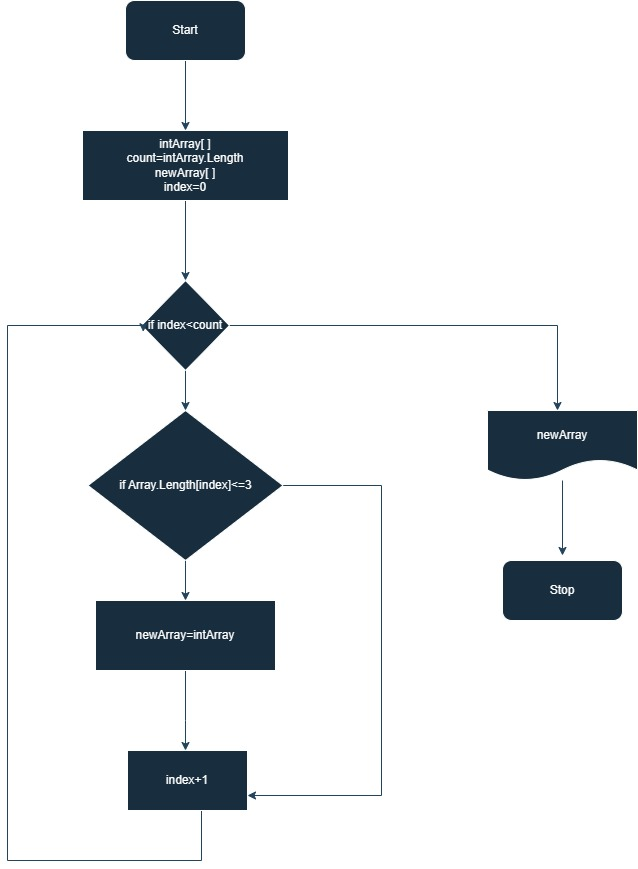

#Итоговая проверочная работа

####Задача: 
Написать программу, которая из имеющегося массива строк формирует массив строк, меньше или равна 3 символам.
Первоночальный массив вводится с клавиатуры или задается на старте.выполнения алгоритма.

###Блок схема

1.Объявляются два метода: "Print1DArry" и "GetNewArray".
2.Метод "Print1DArry" выводит на экран одномерный массив строк.
3.Метод "GetNewArray" принимает два параметра: массив строк "arry" и число "count", и возвращает новый массив строк, состоящий из строк, длина которых не больше "count".
4.Запрашивается ввод пользователем строк через пробел.
5.Считывается введенная строка и разбивается на элементы массива строк при помощи метода "Split".
6.Создается новый массив строк "resultStrarry", который заполняется вызовом метода "GetNewArray" с параметрами "strarray" и "3".
7.Выводится исходный массив, вызывая метод "Print1DArry" с параметром "strarray".
8.Выводится массив строк длиной не больше 3, вызывая метод "Print1DArry" с параметром "resultStrarry".
9.Если массив строк длиной не больше 3 пустой, выводится сообщение "Массив пустой!!!"